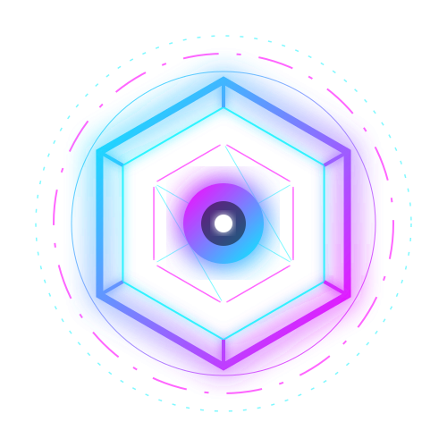
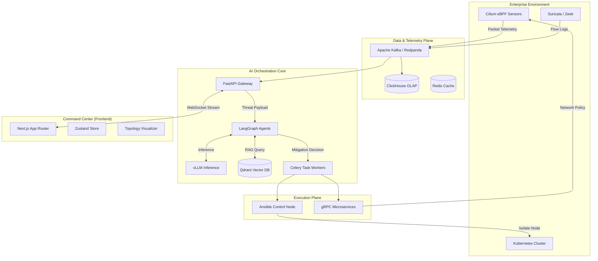
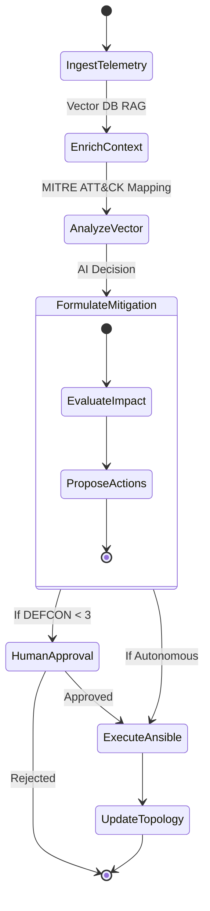

<div align="center">
  
  <h1 align="center">AETHERIS</h1>
  <p align="center">
    <strong>Next-Generation Autonomous Multimodal AI Cyber Defense Platform</strong>
  </p>
  
  <p align="center">
  </a>
    </a>
    
    
  </p>
  
  <p align="center">
    <a href="#vision">Vision</a> •
    <a href="#architecture">Architecture</a> •
    <a href="#ai-engine">AI Engine</a> •
    <a href="#roadmap">Roadmap</a> •
    <a href="#getting-started">Deploy</a>
  </p>
</div>

---

## ⚡ Vision Statement

Modern cyber warfare operates at machine speed; human-in-the-loop Security Operations Centers (SOC) are fundamentally obsolete against automated zero-day campaigns. **Aetheris** is designed to shift the paradigm from reactive monitoring to **deterministic, autonomous orchestration**.

Built with the engineering rigor of a DARPA initiative and the scalability of a venture-backed infrastructure platform, Aetheris acts as the digital nervous system for enterprise security. It ingests multimodal telemetry across hybrid-cloud environments, correlates threat vectors using advanced AI agents (LangGraph/vLLM), and physically alters network topologies via Kubernetes and Cilium eBPF to neutralize threats—all in milliseconds.

<br/>

## 🔥 Core Capabilities

| Capability | Technical Implementation | Enterprise Value |
| :--- | :--- | :--- |
| **Autonomous Threat Detection** | Real-time Kafka streaming from Zeek/Suricata sensors into ClickHouse for rapid anomaly detection. | Reduces MTTD (Mean Time To Detect) from days to milliseconds. |
| **Multimodal AI Reasoning** | LangGraph state machines paired with Qdrant vector databases for RAG-assisted MITRE ATT&CK correlation. | Eliminates alert fatigue; AI contextualizes alerts before human review. |
| **Machine-Speed Remediation** | AI-formulated Ansible playbooks and gRPC triggers to Kubernetes/Cilium eBPF APIs. | Zero-touch containment of lateral movement and payload execution. |
| **Enterprise Sandbox Digital Twin** | Proxmox VE & Terraform dynamically spinning up vulnerable infrastructure for AI cyber range training. | Safe, isolated testing of AI containment logic against real malware. |
| **Cinematic Command Center** | Next.js 16, Zustand, and Framer Motion powering a highly reactive, 60fps glassmorphism topology map. | Provides elite situational awareness and reduces cognitive load during active attacks. |

<br/>

## 🏗️ Architecture Overview

Aetheris utilizes a decoupled, distributed microservices architecture designed to process petabytes of telemetry without dropping packets.

### High-Level System Flow



<br/>

## 🛠️ Technology Stack Breakdown

<details>
<summary><strong>Frontend Visualization (Command Center)</strong></summary>

- **Next.js (App Router)**: Edge-ready, heavily optimized SSR and routing framework.
- **Tailwind CSS v4 & Framer Motion**: Custom cyberpunk/glassmorphism design tokens enabling cinematic, 60fps layout transitions.
- **Zustand**: High-performance, boilerplate-free state machine driving the real-time simulation engine without React re-render bloat.
- **React Flow / Custom SVGs**: Real-time rendering of dynamic enterprise topologies and lateral movement vectors.
</details>

<details>
<summary><strong>Backend & API Gateway</strong></summary>

- **FastAPI (Python)**: Async-first gateway handling thousands of concurrent WebSocket telemetry streams.
- **Golang Microservices**: Deployed for raw packet parsing and gRPC communication with infrastructure.
- **Celery**: Distributed task queue for executing asynchronous mitigation workflows (e.g., SSH into nodes).
</details>

<details>
<summary><strong>AI & Machine Learning Core</strong></summary>

- **LangGraph & LangChain**: Deterministic routing of AI thought processes (Ingest -> Enrich -> Analyze -> Mitigate).
- **vLLM**: High-throughput, memory-efficient local LLM serving.
- **Qdrant / Milvus**: Vector databases storing MITRE ATT&CK frameworks and historical incident embeddings for RAG.
- **Ray RLlib**: (Future) Reinforcement learning for optimizing AI mitigation policies in the sandbox.
</details>

<details>
<summary><strong>Data, Telemetry, & Infrastructure</strong></summary>

- **Kafka / Redpanda**: Distributed event streaming capable of handling high-velocity network flow logs.
- **ClickHouse**: Columnar database for sub-second analytical querying over massive historical datasets.
- **Kubernetes & Terraform**: Declarative infrastructure orchestration for the enterprise digital twin.
- **Cilium eBPF**: Kernel-level network visibility and dynamic policy enforcement.
</details>

<br/>

## 🧠 AI Reasoning Workflow

Aetheris does not rely on opaque LLM hallucination. It uses a **Deterministic StateGraph**.



<br/>

## 🗺️ Phased Expansion Roadmap

We are building this platform incrementally, ensuring each layer is production-grade before scaling to the next.

- [x] **V1: Cyberpunk AI SOC MVP** - Frontend visual foundation, local state engine, simulated WebSocket streams, and core UI mechanics.
- [x] **V2: Telemetry & Ingestion Platform** - Backend FastAPI implementation, real WebSocket streaming, and state schema hardening.
- [x] **V3: Enterprise Sandbox Infrastructure** - Mocked provisioning pipelines for Terraform/Ansible integration.
- [x] **V4: Multimodal AI Core** - Integration of LangGraph state machines in the backend for true cognitive orchestration.
- [x] **V5: Autonomous Security Orchestration** - Closing the loop; backend AI decisions trigger simulated Ansible playbooks and visually isolate nodes.
- [ ] **V6: Enterprise Hardening & Governance** - gRPC microservices, Keycloak OIDC, HashiCorp Vault secrets, strict RBAC, and real Kubernetes/eBPF telemetry ingestion.

<br/>

## 💻 Local Development & Deployment

The current iteration (V5) simulates the massive data pipelines locally to allow for zero-cost, immediate developer onboarding and investor demonstrations.

### 1. Repository Monorepo Structure
```text
aetheris/
├── src/                    # Next.js Frontend Dashboard
│   ├── app/                # App Router Pages
│   ├── components/         # Cyberpunk UI Primitives & Visualizations
│   ├── simulation/         # WebSocket Client Engine
│   └── store/              # Zustand Global State
├── backend/                # FastAPI & AI Engine
│   ├── main.py             # Event Loop & WebSocket Gateway
│   ├── ai_core.py          # LangGraph Cognitive Pipeline
│   └── requirements.txt    # Python Dependencies
├── infrastructure/         # (Future) Terraform & Ansible playbooks
└── package.json            # Node Dependencies
```

### 2. Booting the Command Center
You need Node.js (v18+) and Python (v3.10+).

```bash
# 1. Start the Frontend
git clone https://github.com/yourusername/aetheris.git
cd aetheris
npm install
npm run dev

# 2. Start the AI Backend (In a new terminal)
cd backend
python3 -m venv venv
source venv/bin/activate
pip install -r requirements.txt
uvicorn main:app --port 8000
```
**Access the platform at:** `http://localhost:3000`

<br/>

## 🔐 Security & Governance Model

Aetheris operates on enterprise-grade zero-trust principles:
- **Sandbox Isolation**: All attack simulations and malware testing occur within strict, air-gapped Proxmox/Kubernetes VLANs.
- **RBAC & MFA**: Critical mitigation commands (e.g., dropping databases, severing trunk lines) require multi-factor human cryptographic signing if Autonomous mode is disabled.
- **Immutable Audit Trails**: Every AI thought process and execution trace is logged immutably for compliance and post-mortem review.

<br/>

## 🤝 Contribution Guidelines

We operate like an elite engineering team. We welcome contributions from DevOps engineers, AI researchers, and frontend visualization specialists.
1. **Architecture First**: Do not submit PRs that violate the decoupled architecture. Discuss major changes in Discussions first.
2. **Strict Typing**: All TypeScript and Python (via Pydantic) must be strictly typed.
3. **Commit Standards**: Use Conventional Commits (`feat:`, `fix:`, `chore:`).
4. **Branching**: `main` is production. Feature branches must stem from `develop`.

<br/>

## ⚠️ Disclaimer & License

**AETHERIS is an autonomous cyber warfare tool.** 
This platform contains modules designed to isolate infrastructure and modify kernel-level network policies autonomously. It must **ONLY** be deployed in authorized enterprise environments or sandboxed cyber ranges. The maintainers assume no liability for infrastructural damage caused by autonomous misconfiguration.

Distributed under the **MIT License**. See `LICENSE` for more information.

---

<div align="center">
  <br/>
  
  <h2>AETHERIS</h2>
  <p><b>Defend at Machine Speed.</b></p>
  
  <p align="center">
    <a href="#">
      
    </a>
    <a href="#">
      
    </a>
    <a href="#">
      
    </a>
  </p>
  
  <br/>
  <p>
    <sub>Architected and Built by <b>Deepesh Kakkar</b>.</sub><br/>
    <sub>&copy; 2026 Aetheris Defense Corp. All Rights Reserved.</sub>
  </p>
</div>
