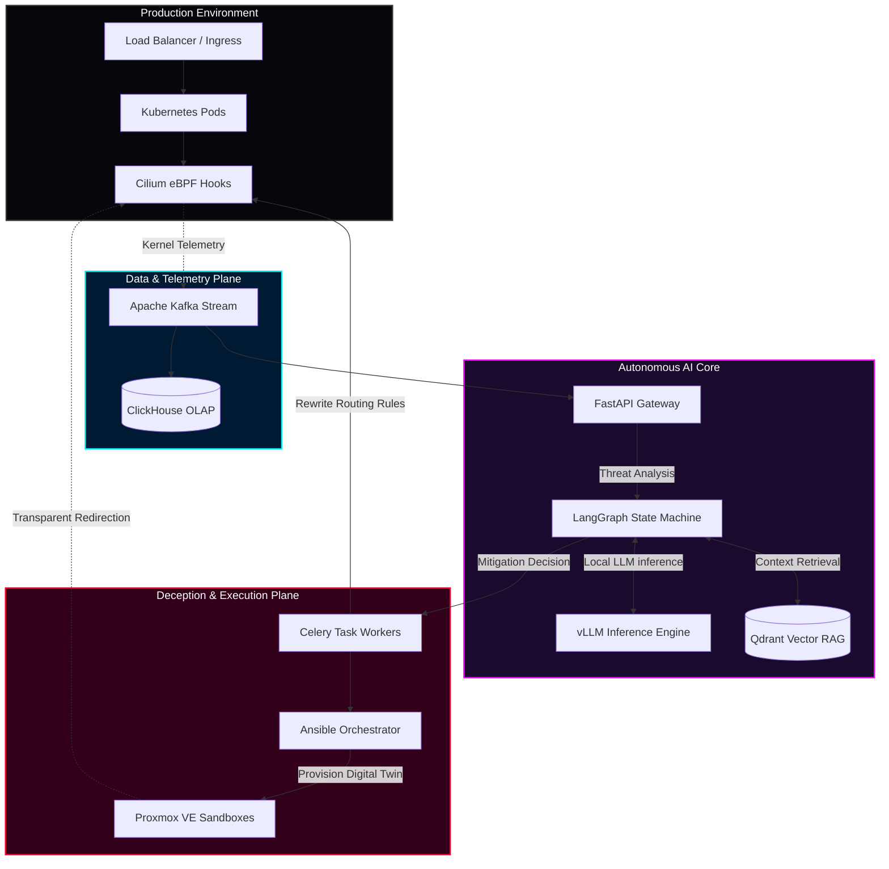
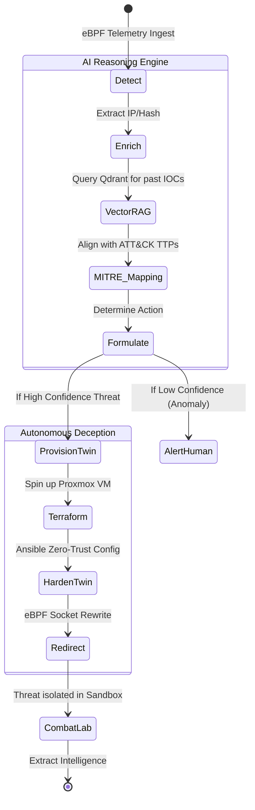

<div align="center">
  
  <h1 align="center">AETHERIS</h1>
  <p align="center">
    <strong>An AI-driven autonomous cyber deception and active defense system that silently redirects attackers into adaptive AI-generated sandboxed digital twins before real infrastructure is compromised.</strong>
  </p>
  
  <p align="center">
    
    
    
    
  </p>
  
  <p align="center">
    
    
    
    
    
    
  </p>
  
  <p align="center">
    <a href="#the-problem">The Problem</a> •
    <a href="#the-solution">The Solution</a> •
    <a href="#core-architecture">Architecture</a> •
    <a href="#ai-cognitive-loop">AI Engine</a> •
    <a href="#getting-started">Deploy</a>
  </p>
</div>

---

<a id="the-problem"></a>
## 🛑 The Problem: Reactive Security is Obsolete

Modern cyber warfare operates at machine speed. By the time a human-in-the-loop Security Operations Center (SOC) receives an alert, triages the telemetry, and formulates a response, the adversary has already achieved lateral movement and data exfiltration.

- **Alert Fatigue**: SOC analysts are drowned in false positives from disconnected SIEMs.
- **Static Defenses**: Traditional honeypots are static, easily fingerprintable, and ignored by sophisticated APTs (Advanced Persistent Threats).
- **Delayed Mitigation**: Manual incident response playbooks cannot compete with automated, polymorphic zero-day campaigns.

<a id="the-solution"></a>
## ⚡ The Solution: AETHERIS

AETHERIS shifts the paradigm from **reactive monitoring** to **deterministic, autonomous orchestration and deception**.

Instead of just blocking an attacker, AETHERIS **deceives** them. When the AI Engine detects anomalous behavior via kernel-level hooks, it autonomously provisions a highly realistic, vulnerable "Digital Twin" of the targeted infrastructure and uses eBPF (Extended Berkeley Packet Filter) to transparently route the attacker's TCP/UDP sessions into this sandbox. 

The attacker believes they are successfully exploiting the production network, while AETHERIS safely extracts their IOCs (Indicators of Compromise), TTPs (Tactics, Techniques, and Procedures), and zero-day payloads in a fully quarantined live-fire combat lab.

<br/>

## 💎 Core Capabilities

| Capability | Technical Implementation | Enterprise Value |
| :--- | :--- | :--- |
| **Autonomous Deception** | Proxmox VE & Terraform dynamically spinning up digital twins on-the-fly. | Attackers waste resources on fake targets while revealing their zero-day exploits. |
| **Kernel-Level Redirection** | Cilium eBPF intercepting and rewriting socket routing in the Linux kernel. | Attackers are seamlessly moved to the sandbox without dropping the TCP handshake. |
| **Multimodal AI Reasoning** | LangGraph state machines paired with Qdrant vector databases for RAG-assisted MITRE ATT&CK correlation. | Eliminates alert fatigue; AI contextualizes alerts before human review. |
| **Machine-Speed Remediation** | AI-formulated Ansible playbooks and gRPC triggers to Kubernetes/eBPF APIs. | Zero-touch containment of lateral movement and payload execution. |
| **Cinematic Command Center** | Next.js 16, Zustand, and Framer Motion powering a highly reactive, 60fps glassmorphism topology map. | Provides elite situational awareness and reduces cognitive load during active attacks. |

<br/>

<a id="core-architecture"></a>
## 🏗️ Core Architecture

Aetheris utilizes a decoupled, distributed microservices architecture designed to process petabytes of telemetry without dropping packets, instantly routing threats to sandboxed environments.

### Platform Topology



<br/>

<a id="ai-cognitive-loop"></a>
## 🧠 AI Cognitive Loop

Aetheris does not rely on opaque LLM hallucination. It uses a **Deterministic StateGraph** to map out its thought processes, ensuring enterprise governance and predictable mitigation.



<br/>

## 🛠️ Technology Stack Breakdown

Aetheris is engineered using a modern, decoupled microservices architecture designed for absolute extreme performance, zero-latency streaming, and high-fidelity machine learning execution.

<div align="center">

| Layer | Primary Technologies | Architecture Role & Value |
| :--- | :--- | :--- |
| **🌐 Command Center (Frontend)** |     | Next.js 16 (App Router) combined with Framer Motion provides a highly optimized, 60fps cinematic glassmorphism UI. Delivers elite, real-time God-level situational awareness during active threat engagements. |
| **⚡ API Gateway & Backend** |     | Asynchronous Python engine handling thousands of concurrent WebSocket telemetry streams and serving as the primary bridge between the data plane and the frontend orchestration layer. |
| **🧠 AI & Machine Learning Core** |     | LangGraph orchestrates deterministic state machine routing, replacing opaque LLM hallucination with predictable, enterprise-grade AI reasoning and mitigation decision trees. |
| **📊 Data & Telemetry Plane** |   | Distributed event streaming (Kafka) paired with sub-second analytical querying (ClickHouse) ensures petabytes of telemetry are processed without dropping critical intrusion packets. |
| **☁️ Infrastructure & DevOps** |     | Declarative infrastructure seamlessly deployed across edge (Vercel) and scalable cloud environments (Railway), orchestrated by Proxmox VE and Cilium eBPF for kernel-level interception. |

</div>

<br/>

<a id="getting-started"></a>
## 🚀 Getting Started

The current iteration simulates the massive data pipelines locally to allow for zero-cost, immediate developer onboarding and investor demonstrations.

### 1. Prerequisites
- Node.js (v18+)
- Python (v3.10+)

### 2. Booting the Command Center

```bash
# 1. Clone & Start the Frontend Next.js Command Center
git clone https://github.com/yourusername/aetheris.git
cd aetheris
npm install
npm run dev

# 2. Start the AI Backend Engine (In a new terminal)
cd backend
python3 -m venv venv
source venv/bin/activate
pip install -r requirements.txt
uvicorn main:app --port 8000
```
**Access the platform at:** `http://localhost:3000`

<br/>

## 🤝 Contribution Guidelines

We operate like an elite engineering team. We welcome contributions from DevOps engineers, AI researchers, and frontend visualization specialists.
1. **Architecture First**: Do not submit PRs that violate the decoupled architecture. Discuss major changes in Discussions first.
2. **Strict Typing**: All TypeScript and Python (via Pydantic) must be strictly typed.
3. **Commit Standards**: Use Conventional Commits (`feat:`, `fix:`, `chore:`).

<br/>

## ⚠️ Disclaimer & License

**AETHERIS is an autonomous cyber warfare tool.** 
This platform contains modules designed to isolate infrastructure and modify kernel-level network policies autonomously. It must **ONLY** be deployed in authorized enterprise environments or sandboxed cyber ranges. The maintainers assume no liability for infrastructural damage caused by autonomous misconfiguration.

Distributed under the **MIT License**.

---

<div align="center">
  <p><b>Defend at God Speed.</b></p>
  
  <p align="center">
    <a href="https://x.com/Deepesh_tsx">
      
    </a>
    <a href="https://www.linkedin.com/in/deepesh-kakkar/">
      
    </a>
    <a href="https://discord.com/users/1165716680610152488">
      
    </a>
  </p>
  
  <br/>
  <p>
    <sub>Architected and Built by <b>Deepesh Kakkar</b>.</sub><br/>
    <sub>&copy; 2026 Aetheris Defense Corp. All Rights Reserved.</sub>
  </p>
</div>
